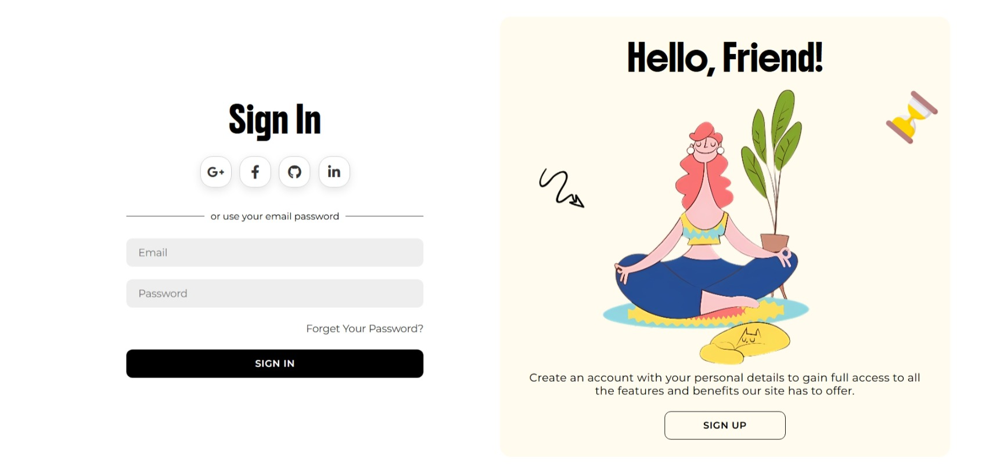

# 🔐 Modern Login Page Template

A modern and visually appealing login page built with **HTML**, **CSS**, and **JavaScript**. This template features a split layout with an illustration and a stylish login form. All assets are organized for easy customization.

## 🚀 Features

- Fully responsive design
- Clean UI with soft shadows and rounded corners
- Social login with icons (Google, Facebook, GitHub, LinkedIn)
- Font Awesome icons via CDN
- Smooth user experience with minimal JavaScript
- Illustration and additional icons from Freepik and Flaticon
- Well-structured files for quick setup

## 📁 Project Structure

LoginPage/ 
          ├── index.html
          ├── style.css 
          ├── script.js 
          ├── preview.jpeg 
          └── images/ 

## 📷 Preview



## 🌐 Used Libraries & Assets

- [Font Awesome 6.4.2 (via CDN)](https://cdnjs.cloudflare.com/ajax/libs/font-awesome/6.4.2/css/all.min.css)
- Illustrations from [Freepik](https://www.freepik.com)
- Icons from [Flaticon](https://www.flaticon.com)

## 📦 Download

Click here to [download the source code](https://github.com/Webweave-Designs/LoginPage/archive/refs/heads/main.zip) or clone the repository:

```bash
git clone https://github.com/Webweave-Designs/LoginPage.git
````
⚠️ Note: The images used in this demo are for preview purposes only. Make sure to check the licenses if you plan to use them in production
